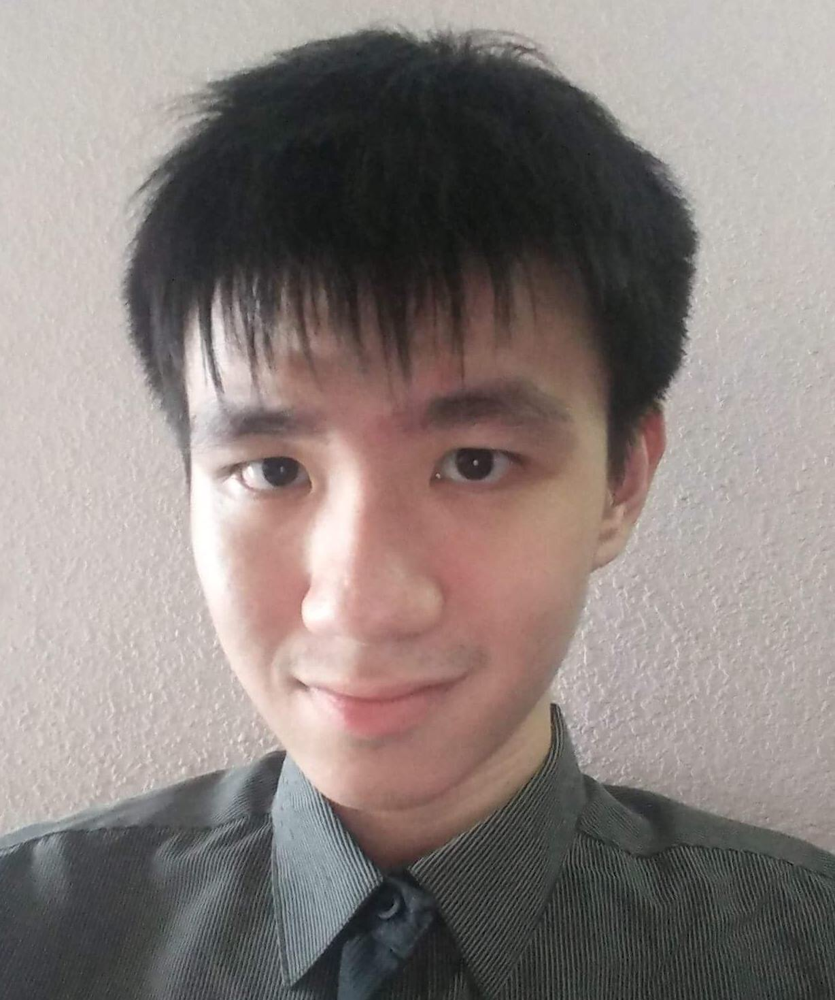
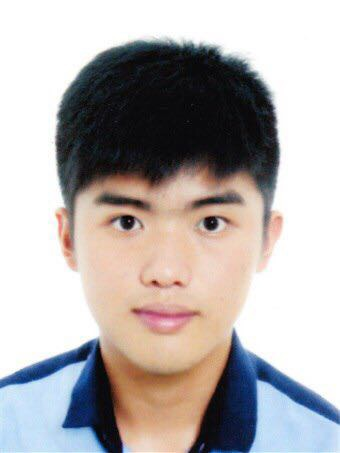
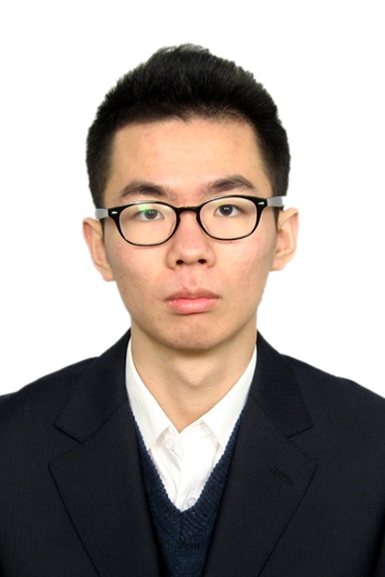

# About Us

We are a team based in the [School of Computing, National University of Singapore](http://www.comp.nus.edu.sg).

## Project Team

#### [NEO WEI JIE ESMOND](http://github.com/zeticious)  
 
**Role**: Project Leader/ Uer Interface IC

-----

#### [KENNY NG JIAN LIANG](http://github.com/kennyngdsc)
 
Role: Developer  
Responsibilities: Code Quality IC

-----

#### [Liu Peng](http://github.com/lproperty)
 
Role: Developer  
Responsibilities: Testing IC

-----

#### [MANISH DAHIYA	](http://github.com/??)
 
Role: Developer  
Responsibilities: Documentation IC

-----
